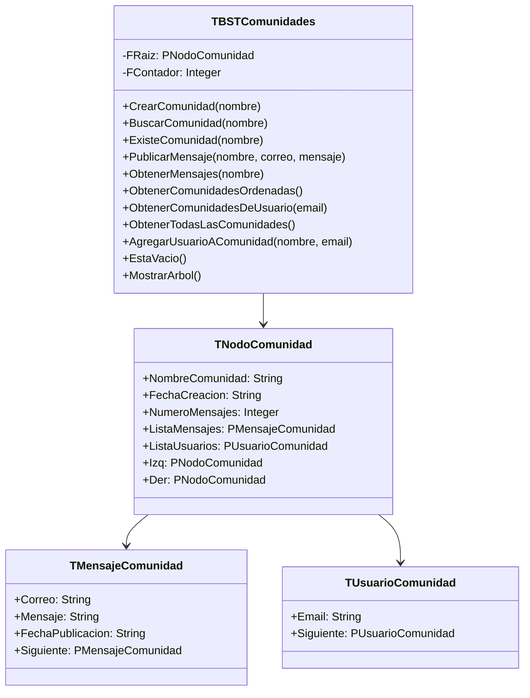
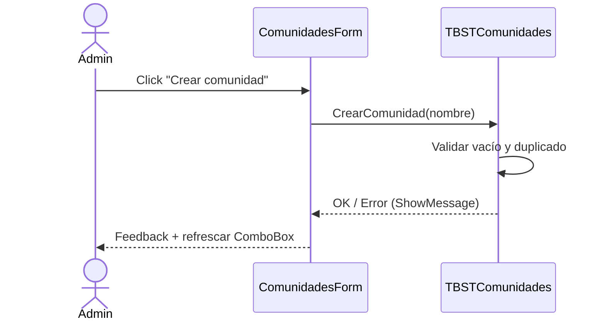
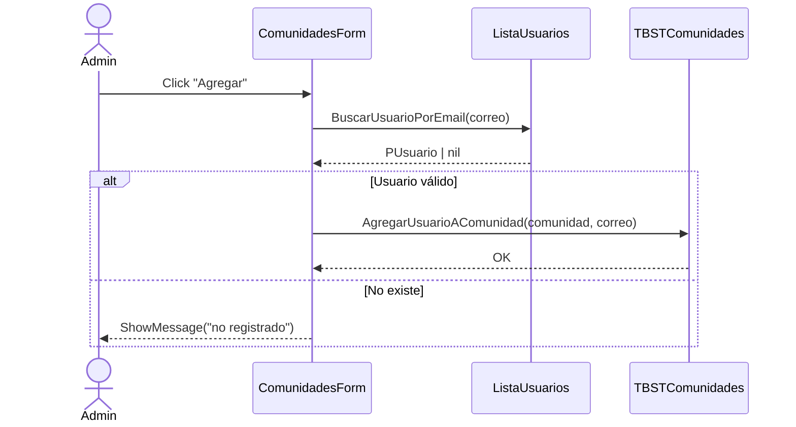
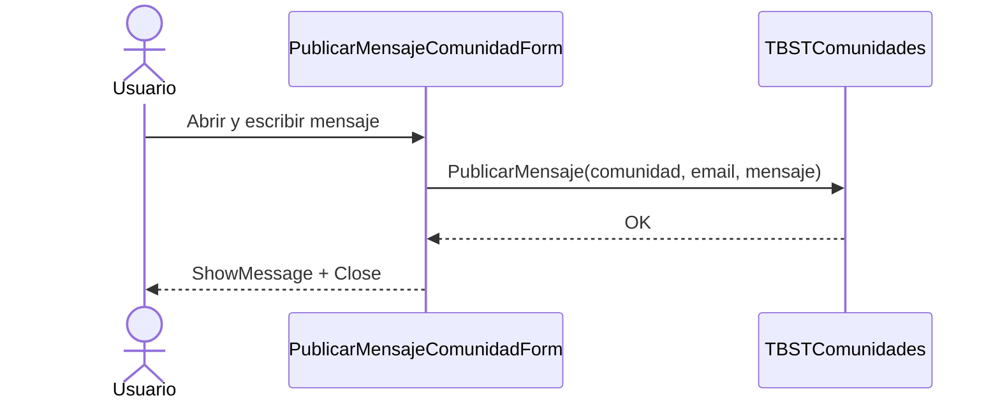
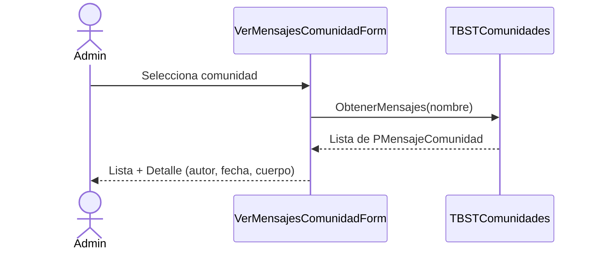

# Manual Técnico del Módulo Comunidades (BST) – Fase 2

**Proyecto en Lazarus / Free Pascal**

Este manual documenta la arquitectura, estructuras de datos, API pública, flujos de UI y lineamientos de pruebas y mantenimiento del módulo de Comunidades implementado con un Árbol Binario de Búsqueda (BST) y listas enlazadas.

---

## 1. Resumen ejecutivo

El módulo Comunidades permite:

- Crear comunidades y gestionarlas dentro de un BST ordenado por `NombreComunidad` (orden lexicográfico, case-insensitive).
- Agregar usuarios a comunidades y publicar mensajes asociados a cada comunidad.
- Recuperar mensajes (por comunidad) y listar comunidades (todas, ordenadas, o filtradas por usuario).
- Integración a UI mediante formularios para: crear comunidad, agregar usuarios a una comunidad, publicar mensajes y visualizar mensajes.

**Tecnologías y dependencias clave:** Lazarus/Free Pascal (`{$mode ObjFPC}{$H+}`), formularios LCL, unidades propias de estructura de datos (lista simple, matriz dispersa, etc.).

---

## 2. Arquitectura y módulos

```
Global                     GlobalComunidades              ArbolBSTComunidades
└─ InicializarSistema()    ├─ ArbolComunidades:TBST…      ├─ Clase TBSTComunidades
   ├─ ListaUsuarios        ├─ InicializarComunidades()    │  (BST de PNodoComunidad)
   ├─ MatrizCorreos        └─ FinalizarComunidades()      └─ Estructuras y utilidades
   └─ InicializarComunidades()                                 (mensajes, usuarios)

UI / Formularios (LCL)
├─ ComunidadesForm (Crear, Agregar usuario)
├─ PublicarMensajeComunidadForm (Publicar)
└─ VerMensajesComunidadForm (Listar y ver detalle)
```

### 2.1 Unidades

**ArbolBSTComunidades:** Implementa el BST de comunidades y sus operaciones.

**GlobalComunidades:** Provee una instancia global `ArbolComunidades` y rutinas de ciclo de vida.

**Global:** Integra `GlobalComunidades` con el resto del sistema (usuarios, matriz de correos, etc.).

**Formularios:**

- `ComunidadesForm`: crear comunidades, agregar usuarios a comunidad.
- `PublicarMensajeComunidadForm`: publicar mensajes (contextual al usuario logueado).
- `VerMensajesComunidadForm`: listar/inspeccionar mensajes por comunidad (vista admin/root).

---

## 3. Capturas de pantalla (UI)

subir imagenes de la integracion 

### 3.1 Ver Mensajes de Comunidad


Pantalla que permite al administrador/root seleccionar una comunidad y visualizar los mensajes publicados. Al elegir un mensaje, se muestra el autor, la fecha y el contenido completo.

### 3.2 Publicar Mensaje en Comunidad


Ventana emergente para que un usuario seleccione la comunidad (a la que pertenece) y publique un nuevo mensaje.

### 3.3 Gestión de Comunidades


Formulario para crear nuevas comunidades y agregar usuarios existentes a comunidades ya registradas.

---

## 4. Estructuras de datos


## Global para las comunidades


### 4.1 Comunidad (nodo BST)

```pascal
PNodoComunidad = ^TNodoComunidad;
TNodoComunidad = record
  NombreComunidad: String;
  FechaCreacion: String;          // dd/mm/yyyy hh:nn
  NumeroMensajes: Integer;
  ListaMensajes: PMensajeComunidad; // pila/LS enlazada (push al inicio)
  ListaUsuarios: PUsuarioComunidad; // LS sin duplicados
  Izquierdo, Derecho: PNodoComunidad; // enlaces BST
end;
```

### 4.2 Mensajes (lista enlazada simple)

```pascal
PMensajeComunidad = ^TMensajeComunidad;
TMensajeComunidad = record
  Correo: String;
  Mensaje: String;
  FechaPublicacion: String;       // dd/mm/yyyy hh:nn
  Siguiente: PMensajeComunidad;
end;
```

### 4.3 Usuarios en comunidad (lista enlazada simple, no duplicados)

```pascal
PUsuarioComunidad = ^TUsuarioComunidad;
TUsuarioComunidad = record
  Email: String;
  Siguiente: PUsuarioComunidad;
end;
```

### 4.4 Listas para recorridos (auxiliares)

```pascal
PEsElemento = ^TElementoListaComunidad;
TElementoListaComunidad = record
  Nodo: PNodoComunidad;            // referencia a comunidad
  Siguiente: PElementoListaComunidad;
end;
```

---

## 5. Clase TBSTComunidades – API pública y responsabilidades

### 5.1 Ciclo de vida

- **`constructor Create`**: inicializa `FRaiz=nil`, `FContador=0`.
- **`destructor Destroy`**: libera recursivamente el árbol, listas de mensajes y usuarios.

### 5.2 Operaciones principales

#### `procedure CrearComunidad(NombreComunidad: String);`

Valida vacío/duplicado; si procede, inserta (recursivo, orden lexicográfico por `CompareText`).

#### `function BuscarComunidad(NombreComunidad: String): PNodoComunidad;`

Búsqueda recursiva por nombre.

#### `function ExisteComunidad(NombreComunidad: String): Boolean;`

Azúcar sintáctico sobre `BuscarComunidad`.

#### `procedure PublicarMensaje(NombreComunidad, Correo, Mensaje: String);`

Busca comunidad, crea nodo mensaje (con timestamp), inserta al inicio de `ListaMensajes`, incrementa `NumeroMensajes`.

#### `function ObtenerMensajes(NombreComunidad: String): PMensajeComunidad;`

Devuelve cabeza de la lista de mensajes de la comunidad.

#### `function ObtenerComunidadesOrdenadas: PElementoListaComunidad;`

In-orden (izq, raíz, der) → lista auxiliar ordenada por nombre.

#### `function EstaVacio: Boolean;`

`FRaiz=nil`.

#### `procedure MostrarArbol;`

Dump textual del árbol (útil para depuración por consola).

#### `procedure AgregarUsuarioAComunidad(NombreComunidad, Email: String);`

Inserta en `ListaUsuarios` (evita duplicados).

#### `function ObtenerComunidadesDeUsuario(Email: String): PElementoListaComunidad;`

Recorre todo el árbol y agrega a la lista de salida las comunidades donde `Email` está presente.

#### `function ObtenerTodasLasComunidades: PElementoListaComunidad;`

In-orden sobre todo el árbol.

### 5.3 Operaciones privadas relevantes

- **Inserción:** `InsertarRecursivo(Nodo, Nombre)` crea nodo con `FechaCreacion=Now` y listas `nil`.
- **Mensajes:** `AgregarMensajeALista(var Lista, Correo, Mensaje)` push al inicio; `LiberarListaMensajes` libera LIFO.
- **Usuarios:** `AgregarUsuarioALista(var Lista, Email)` evita duplicados; `UsuarioEnComunidad` disponible como utilitario.
- **Memoria:** `LiberarRecursivo` libera subárbol + listas asociadas; `LiberarLista` (listas auxiliares de recorrido).

---

## 6. Flujos de UI (formularios)

### 6.1 ComunidadesForm

**Casos de uso**

#### Crear comunidad

- **Input:** `edtNombreComunidad`.
- **Acciones:** valida no vacío → `ArbolComunidades.CrearComunidad()` → feedback `ShowMessage` → refresca `comboboxComunidad`.

#### Agregar usuario a comunidad

- **Inputs:** `comboboxComunidad`, `edtCorreo`.
- **Validaciones:** comunidad válida, correo no vacío, usuario existe en `ListaUsuarios`.
- **Acción:** `ArbolComunidades.AgregarUsuarioAComunidad()` → feedback `ShowMessage`.

#### Carga de comunidades

`CargarComunidades`: obtiene `ObtenerComunidadesOrdenadas()` y pobla `comboboxComunidad`.

### 6.2 PublicarMensajeComunidadForm

#### Configuración

`ConfigurarPublicarMensaje(EmailUsuario)`: guarda email del autor, setea título y carga solo comunidades donde pertenece (`ObtenerComunidadesDeUsuario`).

#### Publicar

- **Inputs:** `comboboxComunidades`, `edtMensaje`.
- **Validaciones:** comunidad válida, mensaje no vacío.
- **Acción:** `ArbolComunidades.PublicarMensaje(Comunidad, EmailUsuario, Mensaje)` → feedback `ShowMessage` → `Close`.

### 6.3 VerMensajesComunidadForm (vista admin/root)

#### Comportamiento

- `ConfigurarVerMensajes`: título admin, carga todas las comunidades `ObtenerTodasLasComunidades`.
- `comboboxComunidadesChange`: recarga lista `lstMensajes`.
- `lstMensajesClick`: muestra detalle (autor, fecha, cuerpo) en panel de detalle.

#### Notas

Los mensajes se listan desde la cabeza (último publicado primero). Se muestra un preview (`Copy(… ,1, 40) + '…'`).

---

## 7. Diagramas (Mermaid)

### 7.1 Diagrama de clases (vista lógica)



### 7.2 Flujos principales

#### Crear comunidad



#### Agregar usuario a comunidad



#### Publicar mensaje



#### Ver mensajes (admin/root)



---

## 8. Complejidad y rendimiento

### 8.1 Operaciones sobre el BST

**Inserción/Búsqueda:** O(h) donde h es la altura del árbol.

- En el mejor/promedio (árbol balanceado): O(log n).
- En el peor caso (desbalanceado): O(n).

**Recorridos in-orden:** O(n) y generan lista auxiliar.

### 8.2 Listas enlazadas

- **Insertar mensaje:** O(1) (push al inicio).
- **Agregar usuario:** O(k) (para validar duplicado en lista de usuarios de tamaño k).

### 8.3 Consideraciones

Si el volumen de comunidades crece o hay inserciones ordenadas que provoquen desbalance, considerar migrar a AVL/Red-Black.

---

## 9. Validaciones y manejo de errores

- **Nombre de comunidad:** no vacío; evita duplicados (mensaje al usuario vía `ShowMessage`).
- **Usuario inexistente:** al agregar a comunidad, se consulta `ListaUsuarios` (si `nil` → error).
- **Publicación:** comunidad válida y mensaje no vacío.
- **Estados de UI:** combos muestran marcadores como `(No hay comunidades)`; los controladores descartan dichas entradas.

---

## 10. Gestión de memoria

- Cada `TNodoComunidad` posee listas propias de mensajes y usuarios.
- `destructor Destroy` y `LiberarRecursivo` liberan subárbol y listas asociadas (mensajes/usuarios) para evitar fugas.
- Las listas auxiliares de recorrido se liberan con `LiberarLista`.

---

## 11. Guía de integración (checklist)

1. **Referenciar unidades en Global:**

```pascal
uses ..., GlobalComunidades;
```

2. **Inicialización en InicializarSistema:**

```pascal
InicializarComunidades;
```

3. **Finalización en FinalizarSistema:**

```pascal
FinalizarComunidades;
```

4. **Formularios:**

- `ComunidadesForm` para crear/agregar usuarios.
- `PublicarMensajeComunidadForm` para publicar.
- `VerMensajesComunidadForm` para auditoría/visualización.

5. **Usuarios:** asegurar `ListaUsuarios` disponible y con método `BuscarUsuarioPorEmail`.

6. **Formato de fecha:** `FormatDateTime('dd/mm/yyyy hh:nn', Now)` (ajustar locale si es necesario).

---

## 12. Pruebas sugeridas

### 12.1 Unit tests (lógica)

**Inserción y búsqueda:**

Crear varias comunidades (orden aleatorio/ordenado) y verificar búsqueda/contador.

**Duplicados:**

Intentar crear comunidad con nombre existente → debe rechazar.

**Mensajes:**

Publicar varios mensajes, verificar `NumeroMensajes`, orden LIFO y contenido.

**Usuarios:**

- Agregar usuario existente dos veces → no debe duplicar.
- Obtener comunidades por usuario.

### 12.2 UI tests (integración)

- `ComunidadesForm`: validaciones de inputs, refresco de combo, mensajes de feedback.
- `PublicarMensajeComunidadForm`: carga de comunidades del usuario, validación de mensaje.
- `VerMensajesComunidadForm`: cambio de comunidad y visualización de detalle.

---

## 13. Seguridad y consideraciones adicionales

- **Identidad de usuario:** los formularios confían en `EmailUsuario` provisto; integrar con el módulo de autenticación.
- **Entrada de texto:** sanear/limitar longitud de `Mensaje` para evitar UI freezes o desbordes.
- **Internacionalización:** cadenas de `ShowMessage` están en español; centralizar si se requiere i18n.
- **Escalabilidad:** migrar a árbol balanceado si n crece; evaluar índices secundarios si se consulta por correo con alta frecuencia.

---

## 14. Extensiones futuras

- Eliminación/renombrado de comunidades.
- Borrado/edición de mensajes (con permisos y auditoría).
- Paginación de mensajes en UI.
- Exportación (CSV/JSON) de mensajes y miembros por comunidad.
- Persistencia en disco/BD (actualmente in-memory).

---

## 15. Glosario

- **BST (Binary Search Tree):** árbol binario donde `clave(izq) < clave(raíz) < clave(der)`.
- **In-orden:** recorrido que produce claves en orden ascendente.
- **Lista enlazada:** estructura lineal con nodos enlazados por punteros.

---

## 16. Ejemplos de uso (snippet)

```pascal
// Crear e inicializar
InicializarComunidades;
ArbolComunidades.CrearComunidad('Sistemas');
ArbolComunidades.CrearComunidad('Investigacion');

// Agregar usuario
ArbolComunidades.AgregarUsuarioAComunidad('Sistemas', 'ana@usac.edu');

// Publicar mensaje
ArbolComunidades.PublicarMensaje('Sistemas', 'ana@usac.edu', 'Bienvenidos al foro.');

// Enumerar comunidades ordenadas
var L: PElementoListaComunidad := ArbolComunidades.ObtenerComunidadesOrdenadas;
while L <> nil do begin
  WriteLn(L^.Nodo^.NombreComunidad);
  L := L^.Siguiente;
end;

// Liberar
FinalizarComunidades;
```

---

## 17. Checklist rápido (QA)

- [ ] Crear 5+ comunidades y verificar orden in-orden.
- [ ] Publicar 10+ mensajes y validar `NumeroMensajes`.
- [ ] Intentar duplicar comunidad → rechazado.
- [ ] Agregar usuario duplicado → no duplica.
- [ ] Formularios muestran placeholders cuando no hay datos.
- [ ] Sin pérdidas de memoria (probar `Destroy`).

---

**Fin del manual.**
