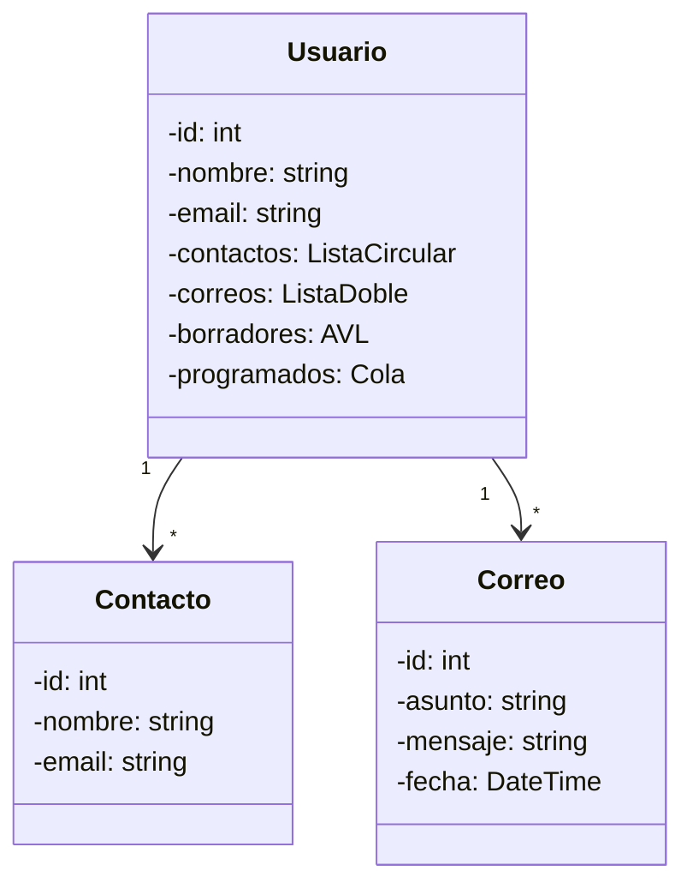
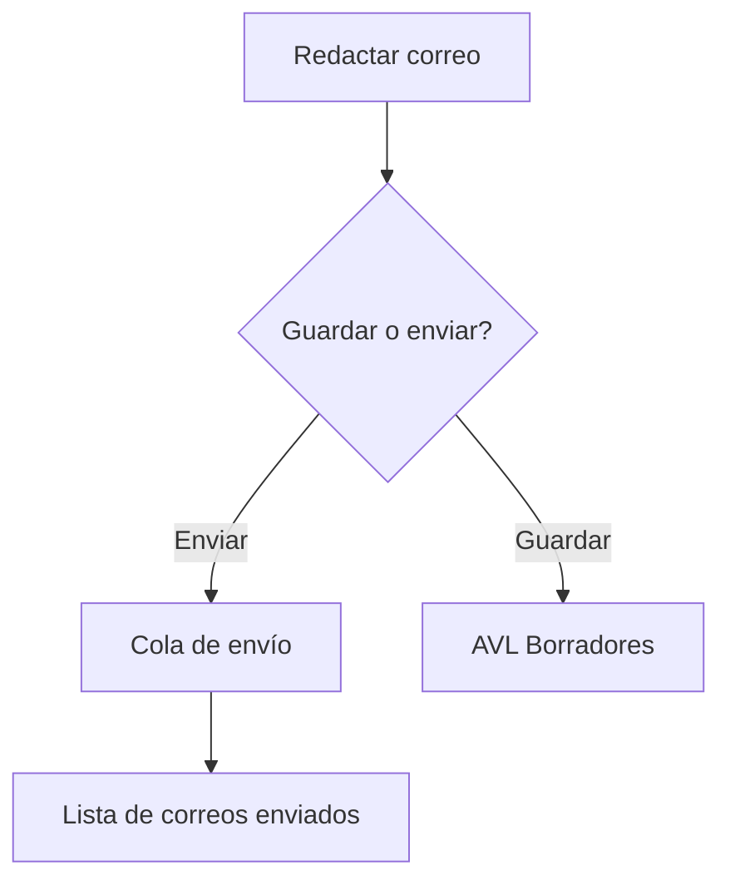

# ⚙️ Manual Técnico  
**Proyecto: EDDMail**  
**Autor:** Josue Daniel Herrera Cotton  
**Carnet:** 202300689  

---

## Introducción  
Este manual está dirigido a programadores y futuros desarrolladores de EDDMail. Explica la arquitectura, estructuras de datos, diagramas de clases, persistencia y recomendaciones para mantener el sistema.  

---

## Índice  
1. Arquitectura del sistema  
2. Estructuras de datos implementadas  
3. Diagramas  
   - Clases  
   - Flujo  
   - Estructuras  
4. Archivos principales  
5. Persistencia de datos  
6. Recomendaciones de desarrollo  
7. Conclusiones  

---

## 1. Arquitectura del sistema  
Componentes principales:  
- **Interfaces (UI):** formularios `.pas` + `.lfm`.  
- **Lógica:** `estructuras.pas` con listas, colas, pilas y árboles.  
- **Persistencia:** archivos JSON (`Usuarios.json`, `Correos.json`).  
- **Main:** `EDDMail.lpr`.  

---

## 2. Estructuras de datos implementadas  

- **Lista circular:** gestión de contactos.  
- **Lista doblemente enlazada:** correos enviados/recibidos.  
- **Cola:** correos programados (FIFO).  
- **Pila:** papelera (LIFO).  
- **AVL:** borradores, optimizando búsqueda.  

---

## 3. Diagramas  

### 📌 Diagrama de clases



### 📌 Diagrama de flujo (envío de correo)



---

## 4. Archivos principales  

- `estructuras.pas`: implementa listas, colas, pilas y árboles.  
- `login.pas`: interfaz de inicio.  
- `interfazusuario.pas`: menú principal.  
- `interfazenviarcorreo.pas`: lógica de envío.  
- `Usuarios.json` / `Correos.json`: persistencia de datos.  

---

## 5. Persistencia de datos  

Ejemplo de `Usuarios.json`:

```json
[
  {
    "id": 1,
    "nombre": "Josue",
    "email": "josue@mail.com",
    "contactos": []
  }
]
```

Ejemplo de `Correos.json`:

```json
[
  {
    "id": 101,
    "remitente": "josue@mail.com",
    "destinatario": "daniel@mail.com",
    "asunto": "Prueba",
    "mensaje": "Hola mundo",
    "fecha": "2025-10-03"
  }
]
```

---

## 6. Recomendaciones de desarrollo  
- Modularizar las interfaces gráficas.  
- Documentar nuevas funciones.  
- Implementar pruebas unitarias en `estructuras.pas`.  
- Usar GitHub para control de versiones.  
- Extender el proyecto con reportes gráficos y autenticación robusta.  

---

## 7. Conclusiones  
EDDMail es un proyecto académico que aplica estructuras de datos en un entorno práctico.  
El código es modular y extensible, lo que facilita su mantenimiento y evolución hacia un cliente de correo más robusto.  
